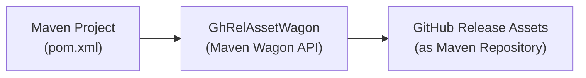

# Overview

The GhRelAssetWagon project is designed to integrate GitHub Release Assets as a Maven repository. This allows Maven projects to utilize binary assets stored in GitHub releases as dependencies. The core functionality is encapsulated in the [`GhRelAssetWagon`]("src/main/java/io/github/amadeusitgroup/maven/wagon/GhRelAssetWagon.java") class, which extends Maven's [`StreamWagon`]("org.apache.maven.wagon/StreamWagon.class") to provide efficient streaming capabilities for fetching and uploading artifacts directly from/to GitHub Releases. This approach leverages GitHub's infrastructure for versioning and distributing binary assets, making it a cost-effective and scalable solution for Maven repository hosting.

# High level design



The diagram above illustrates the integration of [`GhRelAssetWagon`]("src/main/java/io/github/amadeusitgroup/maven/wagon/GhRelAssetWagon.java") within the Maven ecosystem. It acts as a bridge between a Maven project and GitHub Release Assets, treating the latter as a Maven repository. This setup enables Maven to resolve and download dependencies stored as assets in GitHub releases.

## Details

The [`GhRelAssetWagon`]("src/main/java/io/github/amadeusitgroup/maven/wagon/GhRelAssetWagon.java") class implements several key functionalities to interact with GitHub Release Assets:

1. **Authentication and Authorization**: Utilizes GitHub API tokens for secure access to private repositories or to increase rate limits on public repositories.
2. **Release and Asset Identification**: Fetches specific releases and their assets by tags, facilitating version control and dependency management.
3. **Redirect Handling**: Manually handles HTTP redirects to follow asset download links, accommodating GitHub's redirect mechanism for asset downloads.
4. **Asset Downloading**: Downloads assets directly to the local Maven repository or a specified directory, supporting the use of these assets as dependencies in Maven projects.

This solution can be extended to any storage system capable of exposing archive files over HTTP/S, not limited to GitHub. The flexibility of the [`GhRelAssetWagon`]("src/main/java/io/github/amadeusitgroup/maven/wagon/GhRelAssetWagon.java") design allows it to be adapted for use with other platforms that offer similar asset hosting capabilities.

## Extra resources

- [Apache Maven](https://maven.apache.org/)
- [Maven Wagon Project](https://maven.apache.org/wagon/)
- [GitHub Release REST API](https://docs.github.com/en/rest/reference/repos#releases)
- [Java Development Kit (JDK)](https://openjdk.org/)

These resources provide additional information on Maven, the Maven Wagon API, GitHub's REST API for releases, and Java development, offering a comprehensive background for developers working with or extending the GhRelAssetWagon project.


# GhRelAssetWagon

GhRelAssetWagon is a Maven Wagon provider extension that handles the "ghrelasset://" scheme.

## Project Structure

```
GhRelAssetWagon
├── src
|   ├── main
|   |   ├── java
|   |   |   └── io
|   |   |       └── github
|   |   |           └── amadeusitgroup
|   |   |               └── maven
|   |   |                   └── wagon
|   |   |                       ├── GhRelAssetWagon.java
|   |   |                       ├── ChecksumHandler.java
|   |   |                       ├── MavenMetadataHandler.java
|   |   |                       └── RepositoryValidator.java
|   |   └── resources
|   |       └── META-INF
|   |           ├── plexus
|   |           |   └── components.xml
|   |           └── services
|   |               └── org.apache.maven.wagon.Wagon
|   └── test
|       └── java
|           └── io
|               └── github
|                   └── amadeusitgroup
|                       └── maven
|                           └── wagon
|                               ├── GhRelAssetWagonTest.java
|                               ├── ChecksumHandlerTest.java
|                               ├── MavenMetadataHandlerTest.java
|                               └── RepositoryValidatorTest.java
├── .github
|   └── workflows
|       ├── ci.yaml
|       └── maven-central-deploy.yml
├── docs
|   ├── ARCHITECTURE.md
|   ├── MAVEN_CENTRAL_DEPLOYMENT.md
|   └── WAGON_ENHANCEMENT_ANALYSIS.md
├── pom.xml
├── CONTRIBUTING.md
├── LICENSE
└── README.md
```

## Files

### Core Implementation
- `src/main/java/io/github/amadeusitgroup/maven/wagon/GhRelAssetWagon.java`: Main Maven Wagon provider implementation that handles the "ghrelasset://" scheme with enhanced repository functionality.
- `src/main/java/io/github/amadeusitgroup/maven/wagon/ChecksumHandler.java`: Handles MD5, SHA-1, and SHA-256 checksum generation and validation for Maven artifacts.
- `src/main/java/io/github/amadeusitgroup/maven/wagon/MavenMetadataHandler.java`: Generates Maven metadata XML files for group, artifact, and version levels including SNAPSHOT support.
- `src/main/java/io/github/amadeusitgroup/maven/wagon/RepositoryValidator.java`: Validates Maven repository paths and extracts coordinates with support for complex extensions and classifiers.

### Configuration
- `src/main/resources/META-INF/services/org.apache.maven.wagon.Wagon`: Service provider configuration for the Maven Wagon interface.
- `src/main/resources/META-INF/plexus/components.xml`: Plexus container configuration for dependency injection.

### Testing
- `src/test/java/io/github/amadeusitgroup/maven/wagon/GhRelAssetWagonTest.java`: Comprehensive unit tests for the main wagon implementation (27 tests).
- `src/test/java/io/github/amadeusitgroup/maven/wagon/ChecksumHandlerTest.java`: Unit tests for checksum functionality (17 tests).
- `src/test/java/io/github/amadeusitgroup/maven/wagon/MavenMetadataHandlerTest.java`: Unit tests for Maven metadata generation (12 tests).
- `src/test/java/io/github/amadeusitgroup/maven/wagon/RepositoryValidatorTest.java`: Unit tests for repository validation (13 tests).

### Build and Documentation
- `pom.xml`: Maven project configuration with dependencies, plugins, and Maven Central deployment setup.
- `.github/workflows/ci.yaml`: Continuous Integration workflow with comprehensive testing, coverage reporting, and security scanning.
- `.github/workflows/maven-central-deploy.yml`: Maven Central deployment workflow with GPG signing and validation.
- `docs/`: Comprehensive documentation including architecture, deployment guides, and enhancement analysis.
- `README.md`: This documentation file.

## Features

### Core Maven Integration
- **Maven Repository Interface**: Full compatibility with Maven's repository API
- **GitHub Release Integration**: Uses GitHub releases as version containers
- **Artifact Management**: Upload/download JAR files, POMs, and other artifacts
- **Checksum Support**: Automatic MD5, SHA-1, and SHA-256 checksum generation and validation
- **Metadata Generation**: Creates proper Maven metadata files
- **Path Validation**: Ensures proper Maven repository structure

### Repository Standards Compliance
- **Maven Metadata Handler**: Generates XML metadata for group, artifact, and version levels
- **Repository Validator**: Validates Maven repository paths and extracts coordinates
- **Enhanced Checksum Support**: Multiple checksum algorithms with validation

### Performance & Reliability Enhancements
- **Connection Pooling**: Thread-safe connection pooling for GitHub API calls
- **Rate Limit Handling**: Intelligent GitHub API rate limit detection and throttling
- **Retry Logic**: Configurable retry with exponential backoff and jitter
- **Circuit Breaker**: Three-state circuit breaker for fail-fast behavior
- **Async Operations**: Thread pool-based asynchronous task execution

### Advanced Features
- **Parallel Operations**: Concurrent file uploads and downloads with thread pool management
- **Delta Sync**: Incremental synchronization with snapshot-based change detection
- **Compression Support**: Multi-format compression (GZIP, ZIP, TAR) with configurable levels
- **Metrics Collection**: Comprehensive monitoring with counters, gauges, timers, and alerts
- **External Configuration**: Configuration management with encryption, templating, and validation
- **Caching**: Local caching for improved performance
- **Authentication**: Secure token-based authentication with GitHub

### Enhanced Wagon Interface Support
- **File Listing**: List all artifacts in a release (`getFileList()`)
- **Resource Existence Checking**: Verify if artifacts exist before download (`resourceExists()`)
- **Directory Upload**: Upload entire directories as individual release assets (`putDirectory()`)
- **Conditional Downloads**: Download only if remote files are newer (`getIfNewer()`)
- **Directory Copy Support**: Full support for directory-based operations (`supportsDirectoryCopy()`)

### Maven Repository Standards Compliance
- **Maven Metadata Generation**: Automatic generation of `maven-metadata.xml` files at group, artifact, and version levels
- **SNAPSHOT Support**: Full support for SNAPSHOT versions with timestamp and build number management
- **Checksum Generation**: Automatic MD5, SHA-1, and SHA-256 checksum generation for all artifacts
- **Repository Structure Validation**: Comprehensive validation of Maven repository paths and coordinate extraction
- **Complex Artifact Support**: Support for artifacts with classifiers and complex extensions (e.g., `.tar.gz`)

### Quality Assurance
- **Comprehensive Testing**: Extensive unit test coverage across core and advanced components
- **Test-Driven Development**: Features implemented using TDD methodology
- **Continuous Integration**: Automated testing, security scanning, and coverage reporting
- **Maven Central Ready**: Full GPG signing and deployment pipeline for Maven Central distribution
- **Security Scanning**: Integrated Trivy vulnerability scanning and SBOM generation

### Security Attestations & Provenance
- **Provenance Attestations**: Cryptographically signed build provenance published via GitHub Attestations and SLSA tooling (effective SLSA level depends on CI configuration)
- **Software Bill of Materials**: SPDX and CycloneDX format SBOMs published to Maven Central
- **Vulnerability Scanning**: Comprehensive security reports in SARIF and JSON formats
- **Code Signing**: GPG-signed artifacts with SHA-256 checksums for integrity verification
- **Build Metadata**: Detailed build environment information for reproducible builds
- **Supply Chain Security**: Complete attestation framework meeting NIST SSDF requirements

## Usage

The GhRelAssetWagon project can be used to integrate GitHub Release Assets as a Maven repository. This section provides instructions on how to publish and consume artifacts from GitHub Release Assets using the GhRelAssetWagon extension.

Note: The following instructions assume that you have a GitHub account and a repository where you can publish and consume artifacts. These instructions are also based on the assumption that you have a basic understanding of Maven and how to configure a Maven project. It is also possible to configure it diffenrently, for example by storing some of the configuration in the `settings.xml` file instead of the `pom.xml` file.

### Creating tokens

You should create a GitHub [fine grained personal access token](https://docs.github.com/en/authentication/keeping-your-account-and-data-secure/managing-your-personal-access-tokens#creating-a-fine-grained-personal-access-token) with the `repo` scope - option: **Only select repositories** and select actual repository to hold the artifacts.

For the sake of security, it is recommended to create two tokens - one for read-only access and one for read-write access. The read-write token should be used only when publishing artifacts.

For consuming the artifacts you will need a read-only access. To reflect that in your token select the `Contents -> Read Only` in the menu.

To be able to publish the artifacts, you will need a read-write access. Select the `Contents -> Read and write` accordingly.


These tokens will need to be exposed as environment variables in the system where the Maven build will be executed. The environment variable should be named `GH_RELEASE_ASSET_TOKEN`. The token should be stored in a secure location and should not be exposed in the build logs or in the source code. 

Recommended way is to store the token in a file with a proper permissions applied and set the environment variable to the path of the file. Nevertheless, the token value can be directly set as an environment variable as well.

### Publishing artifacts to GitHub Release Assets

1. Add the GhRelAssetWagon build extension to your Maven project(`pom.xml`):


```xml
<project xmlns="http://maven.apache.org/POM/4.0.0" xmlns:xsi="http://www.w3.org/2001/XMLSchema-instance"
  xsi:schemaLocation="http://maven.apache.org/POM/4.0.0 http://maven.apache.org/xsd/maven-4.0.0.xsd">
  <modelVersion>4.0.0</modelVersion>
  ...
  <!--
  This section defines the distribution management configuration for the Maven project. 
  It specifies the repository where the project artifacts will be deployed.

  The repository element contains the details of the repository, including its ID and URL. 
  In this case, the repository ID is "github" and the URL is "ghrelasset://myorg/myrepo/0.0.1/demo-ghrel-m2-repo.zip".
  -->
    <distributionManagement>
      <repository>
        <id>github</id>
        <url>ghrelasset://myorg/myrepo/0.0.1/demo-ghrel-m2-repo.zip</url>
      </repository>
    </distributionManagement>

  <build>
    <!--
    This section of the pom.xml file defines the extensions for the project. 
    It includes the configuration for the "ghrelasset-wagon" extension, which is used for handling GitHub release assets. 
    The extension is specified with the groupId "io.github.amadeusitgroup.maven.wagon", the artifactId "ghrelasset-wagon", and the version "0.0.1".
    -->
    <extensions>
      <extension>
        <groupId>io.github.amadeusitgroup.maven.wagon</groupId>
        <artifactId>ghrelasset-wagon</artifactId>
        <version>0.0.1</version>
      </extension>
    </extensions>
  ...
  </build>
</project>

```

2. Export the secret token as an environment variable:

```bash
# Example location of the token - ensure it is secure and not exposed
chmod 600 /home/.local/GhRelAssetWagon/.rw_releases_my_repo_token
export GH_RELEASE_ASSET_TOKEN=/home/.local/GhRelAssetWagon/.rw_releases_my_repo_token
```

3. Deploy the project artifacts:

```bash
mvn clean deploy
```

### Consuming the artifacts from GitHub Release Assets

1. Add the GhRelAssetWagon build extension to your Maven project(`pom.xml`):

```xml
<project xmlns="http://maven.apache.org/POM/4.0.0" xmlns:xsi="http://www.w3.org/2001/XMLSchema-instance"
  xsi:schemaLocation="http://maven.apache.org/POM/4.0.0 http://maven.apache.org/xsd/maven-4.0.0.xsd">
  <modelVersion>4.0.0</modelVersion>
  ...
  <!--
    This section defines the repositories for the project.
    The repository with the ID "github" is configured to use the "ghrelasset" protocol.
    The URL points to a zip file containing the demo-ghrel-m2-repo.zip repository.
  -->
  <repositories>
    <repository>
      <id>github</id>
      <url>ghrelasset://myorg/myrepo/0.0.1/demo-ghrel-m2-repo.zip</url>
    </repository>
  </repositories>
  ...
   <build>
    <extensions>
      <extension>
          <groupId>io.github.amadeusitgroup.maven.wagon</groupId>
          <artifactId>ghrelasset-wagon</artifactId>
          <version>0.0.1</version>
      </extension>
    </extensions>
    </build>
  ...
</project>

```

2. Export the secret token as an environment variable:

```bash
# Example location of the token - ensure it is secure and not exposed
chmod 600 /home/.local/GhRelAssetWagon/.ro_releases_my_repo_token
export GH_RELEASE_ASSET_TOKEN=/home/.local/GhRelAssetWagon/.ro_releases_my_repo_token
```

3. Build the project:

```bash
mvn clean install
```

## Advanced Configuration

### Debug Logs
If you wish to enable debug logs for this Wagon only, you can pass the following flag in your Maven command:
```bash
# before Maven 3.9.0
-Dorg.slf4j.simpleLogger.log.io.github.amadeusitgroup.maven.wagon=debug

# Maven 3.9.0 and later
-Dmaven.logger.log.io.github.amadeusitgroup.maven.wagon=debug
```

### Configuration Options

The GhRelAssetWagon supports external configuration through the `ConfigurationManager`. Create a configuration file (e.g., `ghrelasset-config.json`) with the following options:

```json
{
  "parallel": {
    "enabled": true,
    "maxConcurrency": 4,
    "timeoutSeconds": 300
  },
  "compression": {
    "enabled": true,
    "algorithm": "GZIP",
    "level": 6,
    "minSizeBytes": 1024
  },
  "deltaSync": {
    "enabled": true,
    "snapshotPath": "~/.ghrelasset/snapshots"
  },
  "metrics": {
    "enabled": true,
    "exportFormat": "JSON",
    "exportPath": "~/.ghrelasset/metrics"
  }
}
```

### Environment Variables

- `GH_RELEASE_ASSET_TOKEN`: GitHub personal access token (required)
- `GHRELASSET_CONFIG_PATH`: Path to external configuration file (optional)
- `GHRELASSET_PARALLEL_ENABLED`: Enable/disable parallel operations (optional)
- `GHRELASSET_COMPRESSION_ENABLED`: Enable/disable compression (optional)

## Testing

### Component Tests 
The GhRelAssetWagon project includes comprehensive unit tests covering all components:

- **Core Tests**: `GhRelAssetWagonTest.java` - Main wagon functionality
- **Component Tests**: 
  - `ParallelOperationManagerTest.java` - Parallel operations
  - `DeltaSyncManagerTest.java` - Delta synchronization
  - `CompressionHandlerTest.java` - Compression features
  - `MetricsCollectorTest.java` - Metrics collection
  - `ConfigurationManagerTest.java` - External configuration

Run all tests with:

```bash
mvn test
```

Run tests with authentication token:

```bash
export GH_RELEASE_ASSET_TOKEN=your_token_here
mvn test
```

## Security Verification

### Verifying Release Attestations

Each release includes comprehensive security attestations. To verify the integrity and provenance:

```bash
# Download artifacts from Maven Central
mvn dependency:copy -Dartifact=io.github.amadeusitgroup.maven.wagon:ghrelasset-wagon:0.0.1

# Verify GPG signatures
gpg --keyserver keyserver.ubuntu.com --recv-keys <GPG_KEY_ID>
gpg --verify ghrelasset-wagon-0.0.1.jar.asc ghrelasset-wagon-0.0.1.jar

# Verify SHA-256 checksums
sha256sum -c artifacts.sha256

# Verify SLSA provenance (requires slsa-verifier)
slsa-verifier verify-artifact ghrelasset-wagon-0.0.1.jar \
  --provenance-path *.intoto.jsonl \
  --source-uri github.com/wherka-ama/GhRelAssetWagon
```

### Security Scanning

Download and analyze the Software Bill of Materials:

```bash
# Download SBOM from Maven Central
mvn dependency:copy -Dartifact=io.github.amadeusitgroup.maven.wagon:ghrelasset-wagon:0.0.1:json:sbom-spdx

# Scan for vulnerabilities
grype sbom:ghrelasset-wagon-0.0.1-sbom-spdx.json
```

For detailed information about security attestations, see [Security Attestations Documentation](docs/SECURITY_ATTESTATIONS.md).

## Contributing

Before contributing, please review the [Contribution Guidelines](CONTRIBUTING.md) for more information on the contribution process.

