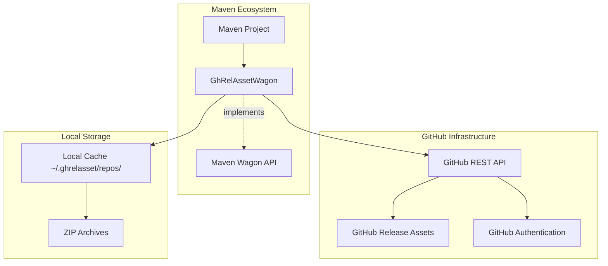
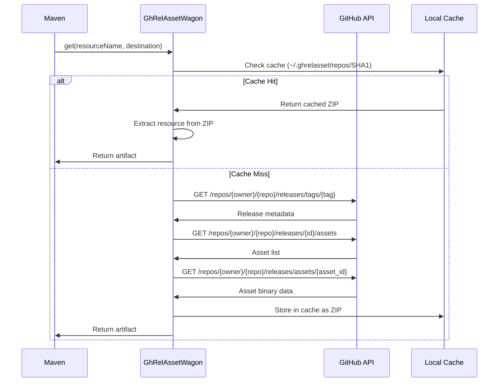
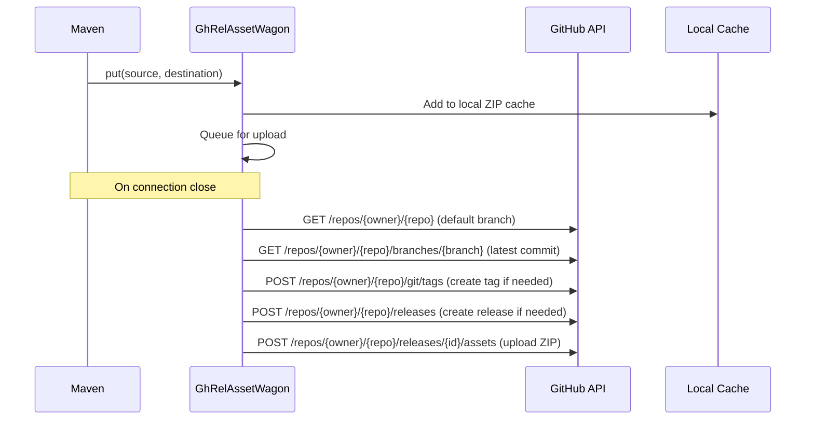

# GhRelAssetWagon Architecture Documentation

## Overview

GhRelAssetWagon is a Maven Wagon provider extension that enables GitHub Release Assets to be used as a Maven repository. It extends Apache Maven's `AbstractWagon` class to support the `ghrelasset://` protocol scheme, allowing Maven projects to publish and consume artifacts directly from GitHub releases.

## Core Methods

The wagon implements the essential AbstractWagon methods:

### Basic Operations
- `get(String, File)` - Downloads artifacts from GitHub release assets
- `put(File, String)` - Stages artifacts for upload to GitHub releases
- `openConnectionInternal()` - Establishes authentication and downloads repository cache
- `closeConnection()` - Uploads staged artifacts to GitHub release

### Enhanced Wagon Interface Methods (Phase 1)
- `getFileList(String)` - Lists all files in a GitHub release directory
- `resourceExists(String)` - Checks if a specific resource exists in the release
- `putDirectory(File, String)` - Uploads entire directories as individual release assets
- `getIfNewer(String, File, long)` - Downloads files only if they are newer than the specified timestamp
- `supportsDirectoryCopy()` - Returns true, indicating support for directory operations.

## Project Information

- **Organization**: Amadeus IT Group
- **License**: Apache License 2.0
- **Java Version**: 1.8+
- **Maven Version**: 3.x
- **Current Version**: 0.0.1

## High-Level Architecture



## Core Components

### 1. GhRelAssetWagon Class
- **Package**: `io.github.amadeusitgroup.maven.wagon`
- **Extends**: `org.apache.maven.wagon.AbstractWagon`
- **Purpose**: Main implementation of the wagon provider

### 2. Service Registration
- **Plexus Component**: `META-INF/plexus/components.xml`
- **Service Provider**: `META-INF/services/org.apache.maven.wagon.Wagon`
- **Role Hint**: `ghrelasset`

## Key Dependencies

| Dependency | Version | Purpose |
|------------|---------|---------|
| Maven Wagon Provider API | 3.4.3 | Core wagon functionality |
| Jackson Databind | 2.17.1 | JSON parsing for GitHub API |
| Commons IO | 2.14.0 | File operations |
| JAXB API | 2.3.1 | XML binding support |

### Test Dependencies
- JUnit Jupiter 5.10.0
- Mockito 4.0.0
- WireMock 3.9.2
- AssertJ 3.26.3

## Architecture Patterns

### 1. Provider Pattern
The project implements the Maven Wagon Provider pattern, allowing Maven to use custom transport mechanisms.

### 2. Repository Pattern
Local caching using SHA-1 hashed directories provides efficient artifact storage and retrieval.

### 3. Builder Pattern
GitHub API interactions use a builder-like approach for constructing requests.

## Data Flow

### Artifact Download Flow


### Artifact Upload Flow


## URL Scheme

The wagon uses a custom URL scheme:
```
ghrelasset://{owner}/{repo}/{tag}/{asset-name}
```

Example:
```
ghrelasset://myorg/myrepo/0.0.1/demo-ghrel-m2-repo.zip
```

## Authentication

### Token-Based Authentication
- Environment variable: `GH_RELEASE_ASSET_TOKEN`
- Supports file-based token storage for security
- Uses GitHub Personal Access Tokens (PAT)
- Required scopes: `Contents: Read` (download) / `Contents: Read and write` (upload)

### Token Configuration
```bash
# Direct token
export GH_RELEASE_ASSET_TOKEN="ghp_xxxxxxxxxxxx"

# File-based token (recommended)
export GH_RELEASE_ASSET_TOKEN="/path/to/token/file"
```

## Local Caching Strategy

### Cache Structure
```
~/.ghrelasset/repos/
└── {SHA1-hash-of-repo-url}/
    └── {maven-artifacts}.zip
```

### Cache Benefits
- Reduces GitHub API calls
- Improves build performance
- Supports offline development
- Handles rate limiting gracefully

## GitHub API Integration

### Endpoints Used
| Endpoint | Method | Purpose |
|----------|---------|---------|
| `/repos/{owner}/{repo}` | GET | Get repository metadata |
| `/repos/{owner}/{repo}/releases/tags/{tag}` | GET | Get release by tag |
| `/repos/{owner}/{repo}/releases` | POST | Create release |
| `/repos/{owner}/{repo}/releases/{id}/assets` | GET | List assets |
| `/repos/{owner}/{repo}/releases/{id}/assets` | POST | Upload asset |
| `/repos/{owner}/{repo}/releases/assets/{id}` | GET | Download asset |
| `/repos/{owner}/{repo}/releases/assets/{id}` | DELETE | Delete asset |
| `/repos/{owner}/{repo}/branches/{branch}` | GET | Get branch info |
| `/repos/{owner}/{repo}/git/tags` | POST | Create git tag |

### API Features
- Manual redirect handling (up to 5 redirects)
- Proper GitHub API versioning (2022-11-28)
- Error handling and retry logic
- Asset replacement capability

## Configuration

### Maven Project Setup

#### For Publishing (Distribution Management)
```xml
<distributionManagement>
  <repository>
    <id>github</id>
    <url>ghrelasset://myorg/myrepo/0.0.1/demo-ghrel-m2-repo.zip</url>
  </repository>
</distributionManagement>

<build>
  <extensions>
    <extension>
      <groupId>io.github.amadeusitgroup.maven.wagon</groupId>
      <artifactId>ghrelasset-wagon</artifactId>
      <version>1.0.0</version>
    </extension>
  </extensions>
</build>
```

#### For Consuming (Repository Configuration)
```xml
<repositories>
  <repository>
    <id>github</id>
    <url>ghrelasset://myorg/myrepo/0.0.1/demo-ghrel-m2-repo.zip</url>
  </repository>
</repositories>

<build>
  <extensions>
    <extension>
      <groupId>io.github.amadeusitgroup.maven.wagon</groupId>
      <artifactId>ghrelasset-wagon</artifactId>
      <version>1.0.0</version>
    </extension>
  </extensions>
</build>
```

## Error Handling

### Connection Errors
- Authentication failures with clear error messages
- Network timeout handling
- GitHub API rate limit handling

### Asset Management Errors
- Missing release/tag creation
- Asset conflict resolution (delete and re-upload)
- Invalid ZIP file handling

### Validation
- URL scheme validation
- Token presence verification
- Repository access validation

## Security Considerations

### Token Security
- Environment variable isolation
- File-based token storage with restricted permissions
- No token logging or exposure in build output

### Access Control
- Fine-grained GitHub permissions
- Repository-specific token scoping
- Read-only vs. read-write token separation

## Performance Optimizations

### Caching Strategy
- SHA-1 based cache keys for uniqueness
- Local ZIP compression for storage efficiency
- Intelligent cache invalidation

### Network Efficiency
- Minimal API calls through caching
- Efficient binary transfer handling
- Connection reuse where possible

## Testing Strategy

### Unit Testing
- Comprehensive test coverage using JUnit 5
- WireMock for HTTP service mocking
- Mockito for dependency mocking
- AssertJ for fluent assertions

### Test Structure
```
src/test/java/com/amadeus/maven/wagon/GhRelAssetWagonTest.java
```

### CI/CD
- GitHub Actions workflow
- Java 17 build matrix
- Maven-based build process
- Automated testing on PR and push

## Extensibility

### Custom Protocol Support
The architecture supports extension to other storage systems:
- Any HTTP/HTTPS-based asset storage
- Custom authentication mechanisms
- Different compression formats

### Plugin Architecture
- Standard Maven extension mechanism
- Plexus component registration
- Service provider interface compliance

## Troubleshooting

### Common Issues
1. **Token Authentication**: Verify `GH_RELEASE_ASSET_TOKEN` is set
2. **Permission Errors**: Check token scopes and repository access
3. **Cache Issues**: Clear `~/.ghrelasset/repos/` directory
4. **Network Issues**: Check GitHub API connectivity

### Debug Logging
The wagon includes extensive logging for troubleshooting:
- API request/response logging
- Cache operations logging
- Error stack traces with context

## Future Enhancements

### Potential Improvements
- Parallel download support
- Advanced caching strategies
- Batch operation support
- Configuration file support
- Maven settings.xml integration

### API Evolution
- Support for newer GitHub API versions
- Enhanced error reporting
- Metrics and monitoring integration

## Conclusion

GhRelAssetWagon provides a robust, secure, and efficient mechanism for using GitHub Release Assets as Maven repositories. Its architecture follows Maven conventions while adding powerful GitHub integration capabilities, making it an ideal solution for organizations wanting to leverage GitHub's infrastructure for Maven artifact distribution.
